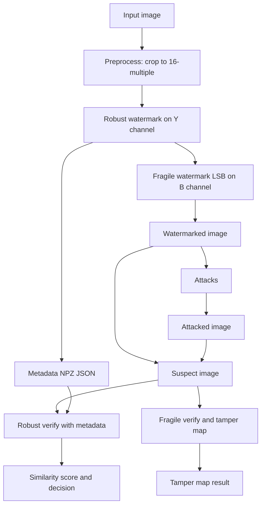

# Dual Watermarking Web App (Robust ID + Fragile Integrity)

A **Streamlit** web application that implements **dual watermarking** on images:

* **Robust watermark (Wavelet-based ID)**: embeds an **ID-derived** watermark designed to remain detectable under common signal-processing attacks (noise, blur, resizing, JPEG, etc.).
* **Fragile watermark (LSB block-hash)**: embeds **block-level integrity hashes** that break under modification to enable **tamper localization**.

This combination supports two complementary goals:

1. **Ownership / identification** under benign-to-moderate distortions (robust).
2. **Integrity verification** and tamper visualization (fragile).

---
## System Architechture


---

## Key Features

### 1) Embed (Robust + Fragile)

* Upload any PNG/JPG image
* Robust watermark is embedded into the **luminance (Y)** channel in the wavelet domain
* Fragile watermark is embedded into the **blue-channel LSBs** as SHA-256 block hashes
* Quality metrics reported:

  * **PSNR**
  * **SSIM**
* Download outputs:

  * Final watermarked image (`.png`)
  * Robust metadata (`.npz` + `.json`) for semi-blind verification

### 2) Attack Laboratory

Applies attacks **only from `src/attacks.py`**, in-memory and reproducible:

* AWGN (Additive White Gaussian Noise)
* Blur (Gaussian)
* Sharpening
* Median filtering
* Resizing (downscale + upscale)
* JPEG compression (in-memory)

Attacks are applied to the **Y channel** to stress-test robust detection while keeping chroma channels unchanged.

### 3) Verify (Robust + Fragile)

* **Fragile verification**:

  * Detects tampered blocks
  * Produces a **tamper map** (red = changed)
  * Produces an **overlay** visualization
* **Robust verification** (semi-blind):

  * Requires the `.npz` metadata generated at embed time
  * Extracts watermark from suspect image and checks:

    * `found` (boolean)
    * `similarity` score
  * Visualizes expected vs extracted watermark patterns

---

## Project Structure

```text
baturyusuf-image-proje/
├── app.py
├── README.md
├── requirements.txt
├── assets/
│   └── csf.csv
└── src/
    ├── attacks.py
    ├── fragile/
    │   └── fragile_lsb.py
    └── robust/
        ├── embedding.py
        └── detection.py
```

**Module responsibilities**

* `app.py`: Streamlit UI and orchestration (embed / attack / verify pages)
* `src/fragile/fragile_lsb.py`: fragile LSB block-hash watermarking + PSNR/SSIM + visual overlays
* `src/robust/embedding.py`: robust ID embedding using DWT + APDCBT-based coefficient selection
* `src/robust/detection.py`: robust extraction/verification, semi-blind reference flow (`.npz`), and wPSNR
* `src/attacks.py`: attack suite for robustness testing

---

## Installation

### 1) Create and activate a virtual environment (recommended)

**Windows (PowerShell)**

```bash
python -m venv .venv
.venv\Scripts\Activate.ps1
```

**macOS / Linux**

```bash
python -m venv .venv
source .venv/bin/activate
```

### 2) Install dependencies

```bash
pip install -r requirements.txt
```

---

## Run the App

```bash
streamlit run app.py
```

Then use the sidebar navigation:

1. **Embed (Robust ID + Fragile Integrity)**
2. **Attack (Only attacks.py)**
3. **Verify (Robust + Fragile)**

---

## How It Works

## Robust Watermark (Wavelet ID)

* The robust watermark is embedded into the **Y (luminance)** channel.
* An input string (e.g., `ID-0001`) is hashed and expanded into a **binary watermark matrix** (default: `32×32`).
* Embedding occurs in the **2-level DWT** sub-bands (LH2 and HL2), using coefficient modulation controlled by:

  * `ALPHA`
  * `BLOCK_SIZE`
  * `WAVELET`
  * `MARK_SIZE`

### Wavelet Transform Details

The wavelet-based robust watermarking uses a multi-stage transformation process:

#### 1. Discrete Wavelet Transform (DWT)
* **Wavelet Type**: Haar wavelet (default)
* **Decomposition Levels**: 2-level DWT
* **Transform Process**:
  1. First level: `image → (LL1, (LH1, HL1, HH1))`
  2. Second level: `LL1 → (LL2, (LH2, HL2, HH2))`

#### 2. Sub-band Selection
* **LH2 (Level 2 Horizontal Detail)**: Contains horizontal edge information
* **HL2 (Level 2 Vertical Detail)**: Contains vertical edge information
* **Rationale**: Detail coefficients are more robust to common image processing attacks

#### 3. APDCBT Transform (Block-level)
* **Block Size**: 4×4 pixels (default)
* **Transform**: Adaptive Polar Cosine Discrete Basis Transform
* **Purpose**: Provides additional energy compaction and robustness
* **Mathematical Basis**: Uses cosine basis functions with adaptive weighting

#### 4. Coefficient Selection Strategy
* **Selection Method**: Magnitude-based ranking
* **Selection Count**: Top coefficients excluding DC component (MARK_SIZE = 1024)
* **Embedding Locations**: Stored in metadata for semi-blind detection

#### 5. Watermark Modulation
* **Modulation Type**: Additive modulation of coefficient magnitudes
* **Strength Parameter**: `ALPHA = 2.0` (default)
* **Formula**: `Y_modified[i] = Y_original[i] + ALPHA × watermark_bit[i]`
* **Sign Preservation**: Coefficient signs are maintained during modulation

#### 6. Inverse Transform
* **Reconstruction**: IDWT (Inverse DWT) in reverse order
* **Process**: `LL2 → LL1 → reconstructed_image`

### Mathematical Formulation

For a coefficient block `C` of size 4×4:

1. **APDCBT Forward**: `Y = APDCBT(C)`
2. **Coefficient Ranking**: `indices = argsort(|Y|)[1:MARK_SIZE+1]`
3. **Watermark Embedding**:
   ```
   Y_watermarked[indices[i]] = Y_original[indices[i]] + α × w[i]
   ```
4. **APDCBT Inverse**: `C_watermarked = IAPDCBT(Y_watermarked)`

### APDCBT Transform Details

The Adaptive Polar Cosine Discrete Basis Transform is defined as:

```
V[m,n] = (N-m)/N²                    if n = 0
V[m,n] = ((N-m)cos(mnπ/N) - csc(nπ/N)sin(mnπ/N))/N²    otherwise

Y = V × C × V^T  (Forward transform)
C = V⁻¹ × Y × (V⁻¹)^T  (Inverse transform)
```

Where:
- `N`: Block size (4)
- `V`: Transform matrix
- `C`: Input coefficient block
- `Y`: Transformed coefficients

### Semi-blind verification (metadata-driven)

Instead of requiring the full original image during verification, the system stores a **reference package**:

* locations of selected coefficients
* reference magnitudes from the cover image
* expected watermark mark

These are stored in the downloadable `.npz`, enabling verification later without the original image.

### Wavelet Robustness Characteristics

The wavelet-based approach provides robustness against common attacks through:

* **Frequency Domain Embedding**: Watermark embedded in mid-frequency bands (LH2/HL2)
* **Magnitude-based Selection**: Uses perceptually significant coefficients
* **Block-wise Processing**: APDCBT provides additional energy compaction
* **Multi-band Redundancy**: Watermark split across LH2 and HL2 sub-bands

**Expected Attack Resistance**:
* ✅ **JPEG Compression**: Mid-range quality factors (QF > 70)
* ✅ **Gaussian Noise**: Low to moderate noise levels (σ < 15)
* ✅ **Geometric Attacks**: Minor resizing (±10%), cropping
* ✅ **Filtering**: Light blur, median filtering (small kernels)
* ⚠️ **Severe Compression**: Very low QF (< 50) may cause detection failure
* ❌ **Geometric Warping**: Rotation, scaling beyond ±15%
* ❌ **Heavy Filtering**: Large blur kernels, aggressive sharpening

---

## Fragile Watermark (LSB Block Hashing)

* The image is divided into fixed blocks (default: `16×16`).
* For each block, a **SHA-256 hash** is computed from:

  * the block’s **MSB content** (LSB removed)
  * the user’s **secret key**
* The resulting 256 hash bits are embedded into the **LSBs** of the block pixels (blue channel).
* During verification, the embedded hash and recomputed hash are compared:

  * mismatch ⇒ block is flagged as **tampered**
  * output ⇒ **tamper map** and count of tampered blocks

---

## Robust Metadata Files

When embedding, you can download:

### `robust_meta_<ID>.json`

Human-readable metadata:

* creation timestamp
* robust ID and hash
* parameters (alpha, threshold, wavelet, etc.)
* image shape

### `robust_meta_<ID>.npz`

Machine-readable reference package (used by verification):

* coefficient locations: `loc_LH2`, `loc_HL2`
* cover reference magnitudes: `ref_LH2`, `ref_HL2`
* expected mark matrix: `mark`
* shape and parameters

---

## Notes on Quality Metrics

* **PSNR / SSIM** are reported for *Original vs Final (Robust+Fragile embedded)*.
* **wPSNR (Y channel)** is reported in the attack lab to quantify perceptual degradation after attacks.

---

## Configuration

Key constants used by the app (see `app.py`):

* Fragile:

  * `FRAGILE_BLOCK_SIZE = 16`
  * `DEFAULT_SECRET_KEY = "my-secret-key"` (change this)

* Robust (from `src/robust/*.py`):

  * `BLOCK_SIZE = 4` (4×4 APDCBT blocks)
  * `ALPHA = 2.0` (watermark embedding strength)
  * `WAVELET = "haar"` (wavelet basis function)
  * `MARK_SIZE = 1024` (32×32 watermark matrix)
  * `THRESHOLD = 11.79` (similarity detection threshold)

### Wavelet Parameter Details

* **BLOCK_SIZE**: Size of APDCBT transform blocks (4×4 = 16 coefficients)
* **ALPHA**: Controls watermark strength vs. image quality trade-off
  * Higher values = stronger watermark, more visible artifacts
  * Lower values = weaker watermark, better image quality
* **WAVELET**: Basis function for DWT ("haar", "db2", "bior2.2", etc.)
  * "haar" provides good frequency localization and computational efficiency
* **MARK_SIZE**: Total watermark bits (1024 = 32×32 binary matrix)
* **THRESHOLD**: Minimum similarity score for positive detection
  * Based on statistical analysis of false positive rates

Recommendation:

* Keep robust parameters consistent between embed and verify.
* Use a strong, unique fragile secret key for meaningful integrity verification.
* Test different ALPHA values (1.0-3.0) to balance robustness vs. quality.

---

## Example Workflow

1. **Embed**

   * Upload image
   * Enter `Robust ID`
   * Enter `Fragile Secret Key`
   * Download:

     * `watermarked_dual.png`
     * `robust_meta_<ID>.npz`

2. **Attack**

   * Upload `watermarked_dual.png`
   * Apply an attack (e.g., JPEG QF=50)
   * Download attacked image

3. **Verify**

   * Upload attacked image
   * Upload `robust_meta_<ID>.npz`
   * Inspect:

     * Fragile tamper map (should often flag changes under attacks)
     * Robust similarity / detection status (should remain detectable under moderate attacks)

---

## Security and Practical Considerations

* The **fragile watermark** is intended for **tamper detection**, so it is expected to break under many transformations (including compression and resizing).
* The **robust watermark** is intended for **ID persistence** under common distortions, but extreme transformations can still cause loss.
* This repository demonstrates a practical dual-watermark workflow rather than claiming cryptographic security guarantees.

---

## Dependencies

* `streamlit` – UI framework
* `numpy`, `pillow` – image processing utilities
* `pywavelets` – wavelet transforms (robust watermark)
* `scipy`, `scikit-image` – filtering, resizing, SSIM
* `mpmath` – APDCBT helper math
---
